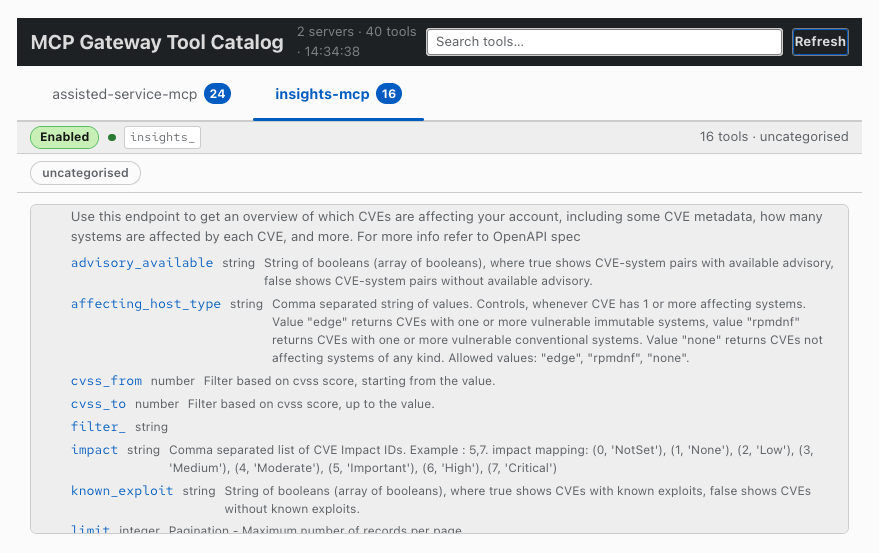
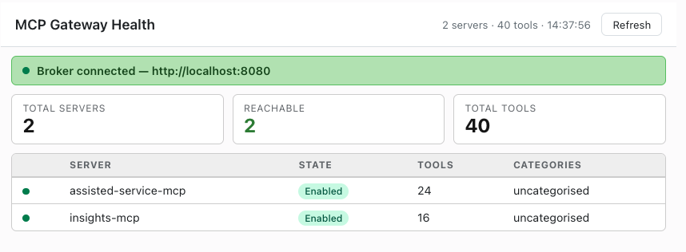
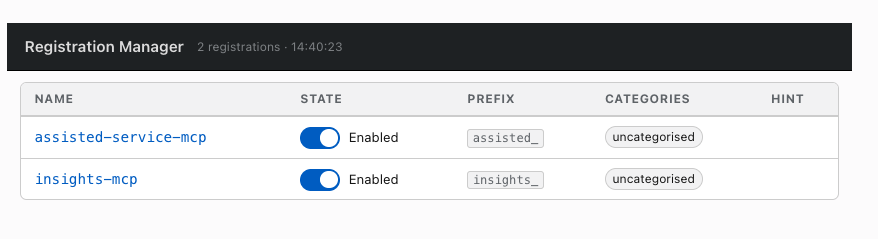
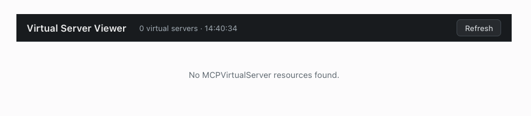

# mcp-gateway-mcp

Admin MCP server for the [mcp-gateway](https://github.com/Kuadrant/mcp-gateway) platform. Exposes Kubernetes CRD state and live broker status as MCP tools and browser-renderable UI widgets — no `kubectl` required.

Target audience: platform engineers operating a running gateway.

## UI Widgets

Four interactive MCP App widgets render as sandboxed iframes in MCP Apps-compatible hosts (Claude, Cursor, VS Code Copilot, ChatGPT, …). See [sample-prompts.md](sample-prompts.md) for the phrases that open each one.

<details>
<summary><strong>Tool Catalog</strong> — <code>ui://mcp-gateway-catalog</code></summary>

Browse all federated tools grouped by server. Click any row to expand the full description and input schema parameters.



</details>

<details>
<summary><strong>Gateway Health Dashboard</strong> — <code>ui://mcp-gateway-health</code></summary>

Live broker status, reachability summary, and per-server tool counts at a glance.



</details>

<details>
<summary><strong>Registration Manager</strong> — <code>ui://mcp-gateway-registrations</code></summary>

Table of all `MCPServerRegistration` CRs with toggle switches to enable or disable each server without `kubectl`.



</details>

<details>
<summary><strong>Virtual Server Viewer</strong> — <code>ui://mcp-gateway-virtual-servers</code></summary>

Accordion view of `MCPVirtualServer` CRs showing upstreams, status conditions, and spec fields.



</details>

## Tools

<details>
<summary>10 tools — click to expand</summary>

| Tool | Access | Description |
|---|:---:|---|
| `list_registrations` | 📖 read | List all `MCPServerRegistration` CRs |
| `get_registration` | 📖 read | Get a single registration with status conditions |
| `update_registration_state` | ✏️ write | Enable or disable a registration |
| `list_virtual_servers` | 📖 read | List all `MCPVirtualServer` CRs |
| `get_virtual_server` | 📖 read | Get a single virtual server |
| `get_gateway_status` | 📖 read | Call the broker `/status` endpoint |
| `render_tool_catalog` | 📖 read | Open the interactive tool catalog widget |
| `render_registrations` | ✏️ write | Open the registration manager widget (toggle switches mutate state) |
| `render_gateway_health` | 📖 read | Open the gateway health dashboard widget |
| `render_virtual_servers` | 📖 read | Open the virtual server viewer widget |

</details>

## Requirements

- Python 3.11+
- [`uv`](https://docs.astral.sh/uv/) for dependency management
- Kubeconfig pointing to a cluster running `mcp-gateway` CRDs
- (Optional) Port-forward to the broker for live status

## Quick start

<details>
<summary>Hosted cluster setup</summary>

```bash
# Forward the broker port
kubectl port-forward svc/mcp-gateway -n mcp-gateway-system 8080:8080 &

# Install dependencies
uv sync

# Run (stdio — for Claude Desktop / Cursor)
uv run server.py --namespace mcp-servers --broker-url http://localhost:8080

# Run (HTTP — for MCP Inspector)
uv run server.py --transport http --namespace mcp-servers --broker-url http://localhost:8080
```

| Item | Value |
|---|---|
| Gateway public URL | `https://mcp.apps.hosted-services.ai5.appeng.rhecoeng.com` |
| CRD namespace | `mcp-servers` |
| Broker service | `svc/mcp-gateway` in `mcp-gateway-system` (port 8080) |
| Registered servers | `assisted-service-mcp` (24 tools, prefix `assisted_`), `insights-mcp` (16 tools, prefix `insights_`) |

</details>

## Configuration

| Flag | Env var | Default | Notes |
|---|---|---|---|
| `--kubeconfig` | `KUBECONFIG` | `~/.kube/config` | Falls back to in-cluster config |
| `--namespace` | `MCP_ADMIN_NAMESPACE` | `mcp-servers` | Namespace where CRDs live |
| `--broker-url` | `MCP_BROKER_URL` | `http://localhost:8080` | Broker `/status` endpoint |
| `--transport` | `MCP_ADMIN_TRANSPORT` | `stdio` | `stdio` or `http` |
| `--addr` | `MCP_ADMIN_ADDR` | `:8899` | HTTP bind address |

## Client config

<details>
<summary>Claude Desktop</summary>

```json
{
  "mcpServers": {
    "mcp-admin": {
      "command": "uv",
      "args": ["run", "/path/to/mcp-gateway-mcp/server.py",
               "--namespace", "mcp-servers",
               "--broker-url", "http://localhost:8080"]
    }
  }
}
```

</details>

<details>
<summary>Cursor (<code>~/.cursor/mcp.json</code>)</summary>

```json
{
  "mcpServers": {
    "gateway-admin": {
      "command": "uv",
      "args": ["run", "/path/to/mcp-gateway-mcp/server.py",
               "--namespace", "mcp-servers",
               "--broker-url", "http://localhost:8080"]
    }
  }
}
```

</details>
